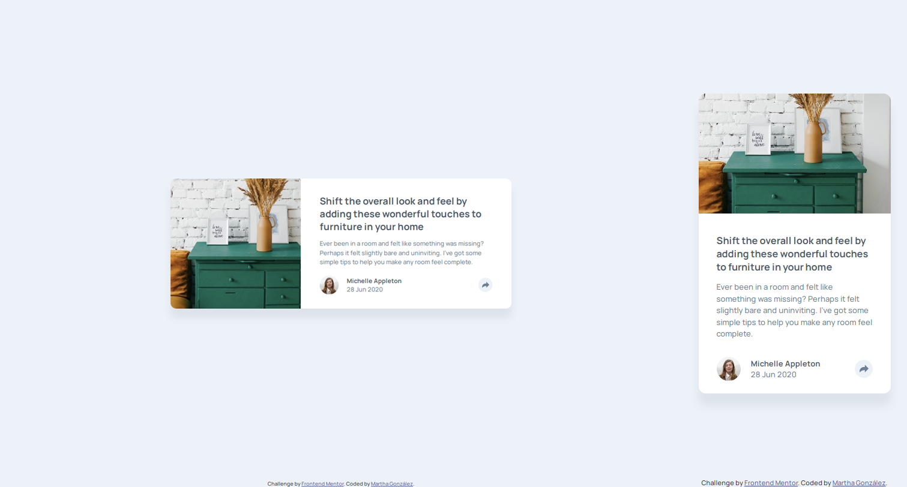

# Frontend Mentor - Article preview component solution

This is a solution to the [Article preview component challenge on Frontend Mentor](https://www.frontendmentor.io/challenges/article-preview-component-dYBN_pYFT). Frontend Mentor challenges help you improve your coding skills by building realistic projects. 

## Table of contents

- [Overview](#overview)
  - [The challenge](#the-challenge)
  - [Screenshot](#screenshot)
  - [Links](#links)
- [My process](#my-process)
  - [Built with](#built-with)
  - [What I learned](#what-i-learned)
  - [Continued development](#continued-development)
  - [Useful resources](#useful-resources)
- [Author](#author)
- [Acknowledgments](#acknowledgments)

## Overview

### The challenge

Users should be able to:

- View the optimal layout for the component depending on their device's screen size
- See the social media share links when they click the share icon

### Screenshot

- Left side: Desktop version
- Right side: Mobile version

### Links

- Solution URL: [Repository](https://github.com/margga88/article-preview-component)
- Live Site URL: [Here](https://margga88.github.io/article-preview-component/)

## My process

### Built with

- Semantic HTML5 markup
- CSS custom properties
- Flexbox
- CSS Grid
- Mobile-first workflow
- CUBE CSS methodology

### What I learned

This project was quite a treat or trick for me:

- As usual I continued with the CUBE CSS methodology, which is fantastic and has proved itself quite useful especially when you lose yourself on the way of what were you supposed to do.
- I certainly had to review a few things I haven't done in a while, or I did without even thinking twice, like the horizontal bars, something I used to do wothout even blinking but then found myself at a loss of where to even start with. Luckily for me, I found good resources to work on it and got back in track quickly.
- It's been ages (not really, just a year or two) since I worked with filters, but I'm impressed at how quickly I tackled that, same for overlaying and the overflow property.
- First time to _consciously_ connect JavaScript with an HTML file. I've spent too long working on separate JS files and even building tests and programs, but these rarely have gone connected to HTML. This definitely has made me review the language, and I enjoyed the process, especially when it worked.  

### Continued development

I definitely can't wait for more projects like this one, and I'm making a note here to review the importance of both global variables and local variables.

### Useful resources

- [CSS Horizontal Navigation Bar](https://www.w3schools.com/Css/css_navbar_horizontal.asp) - Excellent resource to review on horizontal bars.

- [CSS filter Property](https://www.w3schools.com/cssref/css3_pr_filter.php) - Good source with demos on the property.

- [How to make a color white using filter property in CSS](https://stackoverflow.com/questions/52829623/how-to-make-a-color-white-using-filter-property-in-css#52829710) - Good for how to make the color white through filter.

- [How to overlay one div over another div using CSS](https://www.geeksforgeeks.org/css/how-to-overlay-one-div-over-another-div-using-css/) - I'm really thankful to this resource for helping me solve the container overlay part. I was almost giving up, until I hit with this and the right property to modify.

- [How to use Screen Size to Execute JavaScript by Michael Bright](https://brightwhiz.com/running-javascript-based-on-screen-size/) - This was quite helpful to depict how to work with the JavaScript file according the screen size.

## Author

- Frontend Mentor - [@margga88](https://www.frontendmentor.io/profile/margga88)

## Acknowledgments

To the Frontend Mentor site and community for their challenges and help. To my family for their support and my only friend who always gets surprised with what I can do.  

